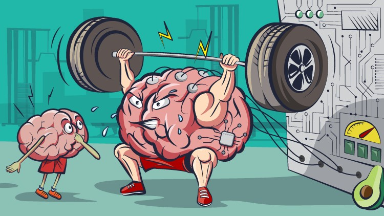

# MACHINE LEARNING PRACTICAL WORKOUT

[Image Source](https://www.udemy.com/course/deep-learning-machine-learning-practical/)

## OVERVIEW
---
These are the projects worked out in the [course](https://www.udemy.com/course/deep-learning-machine-learning-practical/) on Udemy provided by [Dr. Ryan Ahmed](https://www.udemy.com/user/ryan-ahmed/). 
There are a total of 8 Projects from most of the real world cases that uses AI. From time series forecasting using [Prophet](http://facebook.github.io/prophet/) to NLP, this course covers all the areas that uses AI.
  
Project 1 : Car Sales Prediction using ANN 
Project 2 : [CIFAR-10](https://www.cs.toronto.edu/~kriz/cifar.html) Images classification 
Project 3 : [Chicago Crime](https://www.kaggle.com/currie32/crimes-in-chicago) Rate  using Prophet  
Project 4 : Avocado Price using Prophet 
Project 5 : [Traffic Signs](https://www.kaggle.com/meowmeowmeowmeowmeow/gtsrb-german-traffic-sign) Classification 
Project 6 : Email Spam Detection using scikit-learn 
Project 7 : Yelp Reviews Classification using scikit-learn 
Project 8 : [Movie Recommendation](https://grouplens.org/datasets/movielens/100k/) by Item-Based Collaborative Filtering 

## DEPENDENCIES
- [tensorflow](https://www.tensorflow.org/)
- [scikit-learn](https://scikit-learn.org/)
- [prophet](http://facebook.github.io/prophet/)
- [nltk](https://www.nltk.org/)
- [pandas](https://pandas.pydata.org/)
- [seaborn](https://seaborn.pydata.org/)

Install missing dependencies using pip/conda forge

## CREDITS
- Udemy [Course](https://www.udemy.com/course/deep-learning-machine-learning-practical/)
- [Stemplicity](https://www.youtube.com/channel/UC76VWNgXnU6z0RSPGwSkNIg)